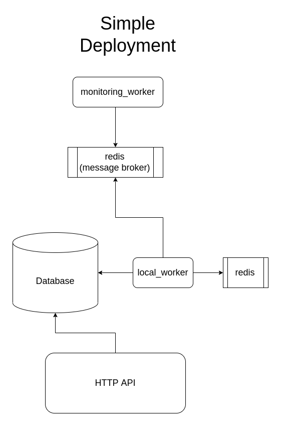
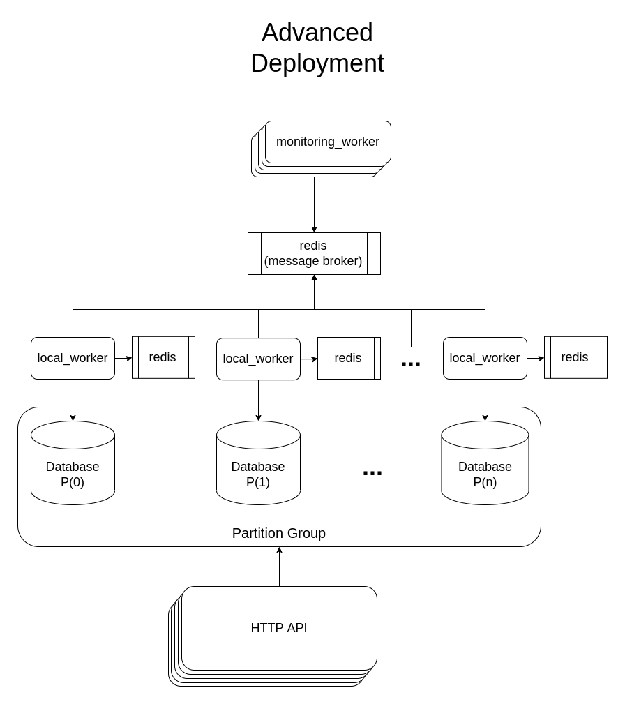

# GoMon
A simple uptime monitoring service written in go.
Users can register urls to this service with their desired threshold and the service will call the url with a GET request at a predesignated period. Once non 200 responses in the past 5m exceed the threshold an alert will be created.
You can also query the service for the number of successful and failed calls in the past 24h. 

---
## Quick start:
To run the service in a test environment you can simply use the provided docker compose file:
```bash
cd gomon  # pwd -> <proj-repo>/gomon/
docker-compose up -d
```
To experiment the concurrency capabilities, config the docker-compose.experiment file and after running the following commands, check the monitoring and local worker logs.
```bash
cd gomon  # pwd -> <proj-repo>/gomon/
docker-compose -f docker-compose.yml -f docker-compose.experiment.yml up -d
```
Along with bringing up the stack, this will populate the database with some random urls using `POPULATE_URL_COUNT` which shows the number of urls to be populated. Note that you need `MAX_URL_COUNT >= POPULATE_URL_COUNT` for proper operation.

*Warning: this compose file might not be suitable for use in production environments and should only be used for testing purposes*

---
## API
Clients can interact with the service through a REST http api. The api currently supports:

- User signup
- User login with JWT authentication
- Register url to be monitored
- List registered urls
- Get number of failed and successful calls for specific url
- Get alerts for specific url

For more details on the exact endpoints please refer to the endpoints dir.

---
### Deployment
This service is comprised of:
- a main http server to perform basic crud operations on the database
- a relational database (currently postgres is used)
- two worker servers:
    - local worker, responsible for i/o between the database and task queue, and the alerting logic
    - monitoring worker, responsible for sending the http request to monitored urls
- a redis cache for local worker
- a machinery task queue and results backend (current default is redis)

The server and worker services are built as a single container image which launches one of the services based on the `FUNC` environment variable. To launch each service `FUNC` should be set to:
- for http server(default): `server`
- for local worker: `local_worker`
- for monitoring worker: `monitoring_worker`

**A simple deployment might look like this:**



---
## Scaling
The system is designed to be scalable from multiple points and to allow distributing workload across multiple physical nodes.

You can introduce replicas of the monitoring worker to increase concurrency and the volume of requests you are able to send. The physical location of the workers isn't important as long as i/o from the message broker doesn't become a bottle-neck. You can also change the `MONITORING_SERVER_CONCURRENCY` environment variable to configure per worker concurrency, the default is 15.

The http server is stateless and therefore can also scale like monitoring worker. You'd probably want to increase the number of replicas if your instance is experiencing higher traffic.

Since data on one url doesn't have any codependence on data from other urls, you can also partition the database tables by url id and have a local worker instance with it's own redis cache for each partition, this will make handling url call failures and report aggregation.\
Multiple local workers can share the same redis cache however it is recommended for each worker to have it's own cache on the same physical node to minimise latency.
Also, never deploy two local workers on the same database partition as this will cause periodic tasks to be run twice.

A fully scaled deployment might look something like this:

